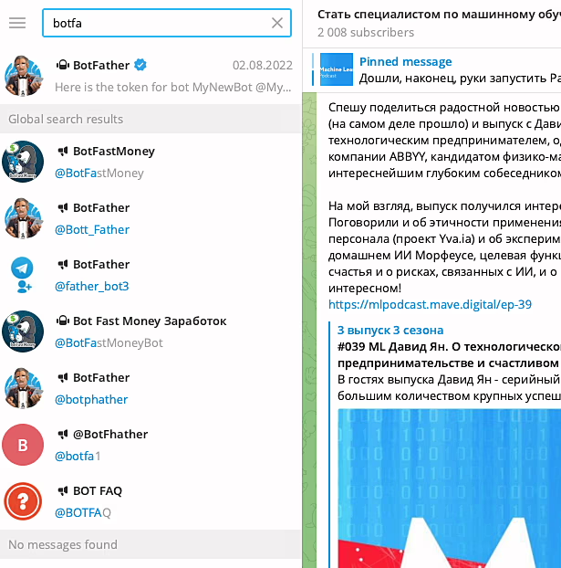
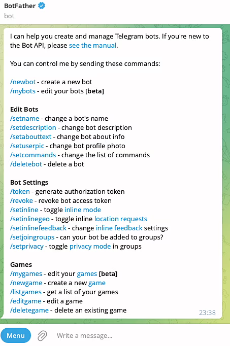
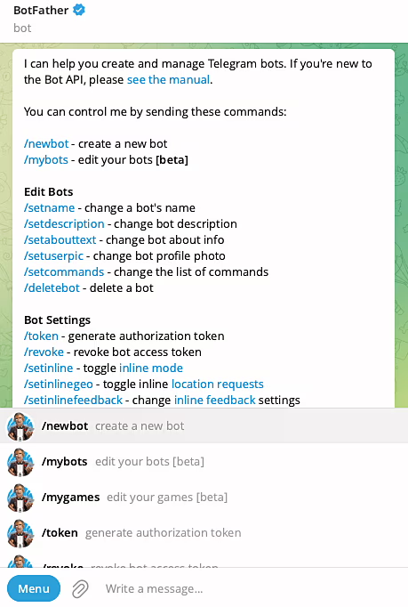
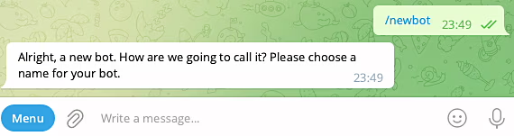
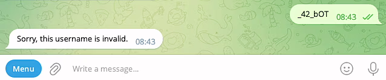
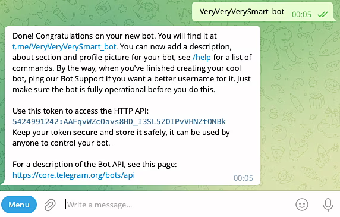

# Чтобы запустить данный код через IDE, через командную строку и в качестве телеграм-бота, следуйте этим инструкциям:

## Через IDE:
1. Установка зависимостей:
Убедитесь, что у вас установлены все зависимости, указанные в файле 'requirements.txt'. Если нет, установите их, 
выполнив следующую команду:
```bash
pip install -r requirements.txt
```
2. Запуск кода:
Откройте файл 'bot.py' в вашей IDE (например, PyCharm, VSCode, etc.). Запустите код, нажав на кнопку запуска или 
используя соответствующую комбинацию клавиш. В случае PyCharm, вы можете просто нажать кнопку "Run" рядом с определением 
функции main.
#### Через командную строку:
a) Установка зависимостей:
Убедитесь, что у вас установлены все зависимости, указанные в файле requirements.txt. Если нет, установите их, выполнив
следующую команду:
```bash
pip install -r requirements.txt
```
b) Запуск кода:
Откройте командную строку (терминал) и перейдите в директорию, где расположен файл 'bot.py'. 
Затем выполните следующую команду:
```bash
python bot.py
```
##### Как телеграм-бот:
a) Настройка бота в Telegram:
- Создайте бота через BotFather в Telegram и получите токен вашего бота.
- Убедитесь, что у вашего бота включен режим обновлений через polling (опрос).
b) Конфигурация:
- Создайте файл .env, чтобы указать токен вашего бота.
Пример:
```bash
# solana_wallet_telegram_bot/.env

# Настройки токена и списка администраторов для бота.
# BOT_TOKEN - токен для доступа к API Telegram.
BOT_TOKEN=5424991242:AAGwomxQz1p46bRi_2m3V7kvJlt5RjK9xr0
# ADMIN_IDS - список идентификаторов администраторов бота, разделенных запятой.
ADMIN_IDS=173901673,124543434,143343455

# Настройки для подключения к базе данных.
# DB_NAME - название базы данных.
DB_NAME=my_database
# DB_HOST - адрес хоста базы данных.
DB_HOST=localhost
# DB_USER - имя пользователя базы данных.
DB_USER=dbUser
# DB_PASSWORD - пароль для доступа к базе данных.
DB_PASSWORD=dbPassword
```
- Убедитесь, что Redis установлен и запущен на вашем компьютере. Если нет, установите его и запустите.
с) Установка зависимостей:
Убедитесь, что у вас установлены все зависимости, указанные в файле 'requirements.txt'. Если нет, установите их, 
- выполнив следующую команду:
```bash
pip install -r requirements.txt
```
d) Запуск бота:
- Откройте командную строку (терминал) и перейдите в директорию, где расположен файл bot.py.
- Выполните следующую команду:
```bash
python bot.py
```
После запуска бот будет доступен в Telegram для взаимодействия.

Теперь ваш код должен успешно запуститься через любой из этих способов! Дополнительные инструкци по установке и 
настройки 'Redis' и 'bot' описаны ниже.

## Структура проекта:
```bash
📁 solana_wallet_telegram_bot/                   # Директория проекта, основной файл бота.
│
├── .env                                          # Файл с конфигурацией и секретами.
│
├── .env.example                                  # Пример файла .env для других разработчиков.
│
├── .gitignore                                    # Файл для игнорирования файлов системой контроля версий.
│
├── bot.py                                        # Основной файл проекта, точка входа.
│
├── requirements.txt                              # Файл с зависимостями проекта.
│
├── logger_config.py                              # Конфигурация логгера.
│
├── README.md                                     # Файл с описанием проекта.
│
├── my_fast_blog_database.db                      # Файл базы данных SQLite, используемый в проекте. 
│
├── 📁 config_data/                               # Пакет с конфигурационными данными.
│   ├── __init__.py                               # Файл, обозначающий, что директория является пакетом Python.
│   └── config.py                                 # Модуль с конфигурационными данными.
│
├── 📁 database/                                  # Пакет для работы с базой данных.
│   ├── __init__.py                               # Файл-инициализатор пакета.     
│   └── database.py                               # Модуль с шаблоном базы данных.
│
├── 📁 external_services/                         # Пакет, содержащий модули для взаимодействия с внешними сервисами и API.
│    ├── 📁 solana/                               # Подпакет, связанный с интеграцией с Solana.
│    │    ├── __init__.py                         # Файл-инициализатор подпакета.
│    │    └── solana.py                           # Модуль с функциями для работы с кошельками Solana и выполнения транзакций.
│    └── __init__.py                              # Файл-инициализатор пакета external_services.
│ 
├── 📁 filters/                                   # Пакет с кастомными фильтрами.
│   ├── __init__.py                               # Файл, обозначающий, что директория является пакетом Python.
│   └── is_admin.py                               # Модуль с функцией-фильтром для проверки администратора.
│ 
├── 📁 handlers/                                  # Пакет с обработчиками апдейтов.
│   ├── __init__.py                               # Файл, обозначающий, что директория является пакетом Python.
│   ├── admin_handlers.py                         # Модуль с хэндлерами для администраторов.
│   ├── user_handlers.py                          # Модуль с хэндлерами для пользователей с особым статусом.
│   └── other_handlers.py                         # Модуль с хэндлерами для обычных пользователей.
│ 
├── 📁 keyboards/                                 # Пакет с модулями для работы с клавиатурами.
│   ├── __init__.py                               # Файл, обозначающий, что директория является пакетом Python.
│   └──  keyboards.py                             # Модуль с функциями для клавиатур.
│ 
├── 📁 lexicon/                                   # Пакет для хранения текстов ответов бота.
│   ├── __init__.py                               # Файл, обозначающий, что директория является пакетом Python.
│   └── lexicon_en.py                             # Модуль с текстами на английском.
│ 
├── 📁 models/                                    # Пакет с модулями для работы с базой данных.
│   ├── __init__.py                               # Файл, обозначающий, что директория является пакетом Python.
│   └── models.py                                 # Cодержит определения моделей данных, используемых в приложении для 
│                                                 # взаимодействия с базой данных через SQLAlchemy ORM.
├── 📁 states/                                    # Пакет с классами состояний пользователей.
│   ├── __init__.py                               # Файл, обозначающий, что директория является пакетом Python.
│   └── states.py                                 # Модуль с классами состояний.
│ 
└── 📁 utils/                                     # Пакет с вспомогательными модулями.
    ├── __init__.py                               # Файл, обозначающий, что директория является пакетом Python.
    └── utils.py                                  # Модуль с вспомогательными утилитами.
```

## Таблицы в BD: 
┌─────────────────────┐       ┌──────────────────────┐       ┌─────────────────────────────┐
│         User        │       │      SolanaWallet    │       │      SolanaTokenBalance     │
├──────────────┬──────┤       ├───────────────┬──────┤       ├──────────────────────┬──────┤
│     id       │      │       │      id       │      │       │          id          │      │
│(PrimaryKey)  │      │       │(PrimaryKey)   │      │       │    (PrimaryKey)      │      │
├──────────────┼──────┤       ├───────────────┼──────┤       ├───────────────┬──────┼──────┤
│ telegram_id  │      │       │ wallet_address│      │       │   wallet_id   │      │      │
│ (Unique)     │      │       │ (Unique, NN)  │      │       │ (ForeignKey)  │      │      │
├──────────────┼──────┤       ├───────────────┼──────┤       ├───────────────┼──────┤      │
│  username    │      │       │  private_key  │      │       │  token_address│      │      │
│  (Nullable)  │      │       │   (NotNull)   │      │       │   (NotNull)   │      │      │
└──────────────┴──────┘       ├───────────────┤      │       │  balance      │      │      │
                              │    balance    │      │       │ (Default: 0.0)│      │      │
                              │ (Default: 0.0)│      │       └───────────────┴──────┴──────┘
                              ├───────────────┤      │
                              │   created_at  │      │
                              │ (Default: now │      │
                              │ ())           │      │
                              ├───────────────┤      │
                              │   updated_at  │      │
                              │ (OnUpdate: now│      │
                              │ ())           │      │
                              ├───────────────┤      │
                              │     name      │      │
                              │   (Nullable)  │      │
                              ├───────────────┤      │
                              │  description  │      │
                              │   (Nullable)  │      │
                              └───────────────┘      │
                                                     │
                                                     │
                                                     ∞
                                                     *
                                                     │
                                                     │
                                             ┌─────────────────────┐
                                             │      SolanaToken    │
                                             ├──────────────┬──────┤
                                             │   id         │      │
                                             │(PrimaryKey)  │      │
                                             ├──────────────┼──────┤
                                             │ token_address│      │
                                             │ (Unique, NN) │      │
                                             ├──────────────┼──────┤
                                             │     name     │      │
                                             │  (Nullable)  │      │
                                             ├──────────────┼──────┤
                                             │ description  │      │
                                             │  (Nullable)  │      │
                                             └──────────────┴──────┘

##### User: Таблица с информацией о пользователях.
##### SolanaWallet: Таблица с информацией о кошельках в сети Solana.
##### SolanaTokenBalance: Таблица с информацией о балансах токенов на кошельках в сети Solana.
##### SolanaToken: Таблица с информацией о токенах в сети Solana.

### Комментарии к полям:
- Все таблицы имеют поле id, являющееся первичным ключом.
- В таблице User поля telegram_id и username могут содержать информацию о пользователе. Поле telegram_id уникально и не
  может быть пустым, а username может быть пустым.
- В таблице SolanaWallet поля wallet_address и private_key хранят адрес и приватный ключ кошелька соответственно. Поле 
  wallet_address уникально и не может быть пустым, а private_key не может быть пустым.
- В таблице SolanaTokenBalance поле balance хранит баланс токена на кошельке. Оно имеет значение по умолчанию 0.0.
- В таблице SolanaToken поля token_address хранит уникальный адрес токена в сети Solana.

### Связи:
- У каждого пользователя (User) может быть несколько кошельков (SolanaWallet), связь один-ко-многим.
- У каждого кошелька (SolanaWallet) может быть несколько балансов токенов (SolanaTokenBalance), также связь 
  один-ко-многим.

## Как создать телеграм-бота
Итак, у вас установлен Telegram и есть аккаунт. Отлично! Заходим в поиск и набираем "BotFather". Найдется несколько 
похожих, но нам нужен официальный - с синей галочкой. Ну, или, вот, вам ссылка - @BotFather.

Выбираем правильного "Отца ботов" и нажимаем в открывшемся чате "START"

Появится сообщение со списком команд, которые можно отправить отцу ботов. Там много всего интересного. Сейчас же нас 
интересует команда "/newbot". Либо кликаем прямо по ней, либо еще в левом нижнем углу можно нажать на кнопку "Menu" и
там тоже откроется возможность выбрать нужную команду. Смело нажимаем!


BotFather предложит выбрать имя нашему новому боту.

Пишем любое имя. Его, в дальнейшем, можно будет изменить при желании.

Далее нужно задать username нашему боту - уникальное имя, которое нельзя будет менять, и которое обязательно должно 
оканчиваться на "bot". Причем регистр букв не имеет значения. Может быть и "BOT", и "bot", и "Bot" и даже "boT". Длина 
юзернейма должна быть от 5 до 32 символов. Можно использовать латинские буквы, цифры и подчеркивания. Так написано в 
официальной документации Телеграм.
И хотя, из этого описания можно подумать, что username бота может начинаться с цифры или подчеркивания, на самом деле 
Телеграм не дает этого сделать.


То есть, получается, что username должен быть длиной от 5 до 32 символов, среди которых могут быть буквы, цифры и 
подчеркивания, но начинаться должен обязательно с буквы, а заканчиваться обязательно словом "bot", причем, регистр 
значения не имеет.

Из-за того, что юзернейм должен быть уникальным, подобрать его может быть не очень просто - многие уже заняты. 
Пользователи создавали ботов, игрались, а потом забрасывали их. Наверное, где-то в недрах серверов Telegram существует
кладбище мертворожденных ботов.

Наконец, после очередной попытки, все же удается придумать незанятый username для бота. С чем нас и поздравит Ботопапа.

Для дальнейшей работы нам понадобится токен. Его лучше никому не показывать, чтобы никто не смог от имени вашего бота 
творить всякое. При необходимости токен боту можно поменять. Также через @BotFather.

И имейте в виду, что в рамках одного телеграм-аккаунта допускается управлять максимум 20 ботами. Об этом не сказано в 
официальной документации Telegram (ну, или я не нашел), но выяснено многими пользователями опытным путем.

Примечание. Чтобы на любом этапе взаимодействия с @BotFather получить от него список доступных команд - просто отправьте
в чат с ним команды /start или /help. 


## Установка Redis

### Установка Redis на MacOS
1. Устанавливаем Homebrew в терминале (https://brew.sh/ru/):
    ```bash
    /bin/bash -c "$(curl -fsSL https://raw.githubusercontent.com/Homebrew/install/HEAD/install.sh)"
    ```
2. Устанавливаем Redis в командной строке запускаем:
    ```bash
    brew install redis
    ```
3. После установки попробуйте запустить Redis командой:
    ```bash
    redis-server
    ```
    Пойдут разные сообщения, и, в том числе, у меня появилась картинка:
    ```bash
                    _._                                                  
               _.-``__ ''-._                                             
          _.-``    `.  `_.  ''-._           Redis 7.2.0 (00000000/0) 64 bit
      .-`` .-```.  ```\/    _.,_ ''-._                                  
     (    '      ,       .-`  | `,    )     Running in standalone mode
     |`-._`-...-` __...-.``-._|'` _.-'|     Port: 6379
     |    `-._   `._    /     _.-'    |     PID: 10709
      `-._    `-._  `-./  _.-'    _.-'                                   
     |`-._`-._    `-.__.-'    _.-'_.-'|                                  
     |    `-._`-._        _.-'_.-'    |           https://redis.io       
      `-._    `-._`-.__.-'_.-'    _.-'                                   
     |`-._`-._    `-.__.-'    _.-'_.-'|                                  
     |    `-._`-._        _.-'_.-'    |                                  
      `-._    `-._`-.__.-'_.-'    _.-'                                   
          `-._    `-.__.-'    _.-'                                       
              `-._        _.-'                                           
                  `-.__.-'                    
    ```
    И еще в конце что-то типа:
    ```bash
    10709:M 28 Aug 2023 15:09:47.916 * Done loading RDB, keys loaded: 0, keys expired: 0.
    10709:M 28 Aug 2023 15:09:47.916 * DB loaded from disk: 0.000 seconds
    10709:M 28 Aug 2023 15:09:47.916 * Ready to accept connections tcp
    ```
4. Теперь нужно подключиться к Redis и проверить, что он сохраняет и отдает данные. Для этого запускаем еще один 
   терминал или новую вкладку в том, где вы устанавливали redis и выполняем команду:
    ```bash
    redis-cli
    ```
    Должна появиться строка приглашения к взаимодействию (cli - это от Command Line Interface, то есть интерфейс 
    командной строки):
    ```bash
    127.0.0.1:6379> 
    ```
    Через нее можно отправлять команды в Redis. Например, можно добавить пару "ключ-значение" с помощью команды:
    ```bash
    SET my_key my_value
    ```
    А затем получить значение по ключу
    ```bash
    GET my_key
    ```
    Работает! Чтобы завершить работу Redis - можно в первом терминале, в котором у нас запущен Redis, нажать Ctrl+С или 
    можно не останавливать Redis, а просто выйти из режима командной строки - тогда нужно в терминале, где мы выполняли 
    команду redis-cli выполнить команду quit или exit.
    
    Не смотря на то, что Редису все равно на какой машине он запущен, подразумевается, что он крутится где-то на 
    сервере, а доступ к нему мы имеем через командную строку где-то в другом месте. 

### Установка Redis на Linux
1. Вообще проще некуда:
    ```bash
    sudo apt install redis
    ```
2. Устанавливаем. А затем перезапускаем сервер:
    ```bash
    sudo service redis-server restart
    ```
3. Проверяем, что сервер запущен:
    ```bash
    sudo service redis-server status
    ```
4. Если все ок - среди прочей информации видим строчку:
    ```bash
    Status: "Ready to accept connections"
    ```
5. Пробуем запустить командную строку:
    ```bash
    redis-cli
    ```
    Ну, и можно попробовать позаписывать и почитать пары "ключ-значение", как это описано выше для MacOS, через команды
    SET и GET, чтобы совсем-совсем убедиться, что все работает.

### Установка Redis на Windows
Официальной поддержки для Windows у Redis нет.
1. Заходим в PowerShell от имени администратора и выполняем команду:
    ```bash
    wsl --install
    ```
    Если вы не ставили wsl до этого и вам повезет, то сразу начнется установка программы, а затем установка дистрибутива 
    Linux по умолчанию (Ubuntu). Это нас более чем устраивает. Затем нужно будет перезагрузить компьютер и после 
    перезагрузки можно будет запустить wsl как обычную программу в Windows.
    
    На каком-то этапе нужно будет придумать и ввести имя пользователя и пароль для новой системы. И после этого у вас 
    будет Linux, который можно запускать внутри Windows, то есть должна появиться программа, которая будет называться по
    имени установленного дистрибутива - в нашем случае это Ubuntu.
2. Если же вы уже когда-то ставили wsl, то после команды wsl --install, возможно, вы увидите справку по работе программы
   и тогда нужно выполнить команду:
    ```bash
    wsl --list --online
    ```
    Появится список доступных дистрибутивов и подсказка, что нужно сделать:
    ```bash
    PS C:\WINDOWS\system32> wsl --list --online
    Ниже приведен список допустимых распределений, которые можно установить.
    Установите с помощью команды wsl --install -d <Distro>.
    
    NAME                                   FRIENDLY NAME
    Ubuntu                                 Ubuntu
    Debian                                 Debian GNU/Linux
    kali-linux                             Kali Linux Rolling
    Ubuntu-18.04                           Ubuntu 18.04 LTS
    Ubuntu-20.04                           Ubuntu 20.04 LTS
    Ubuntu-22.04                           Ubuntu 22.04 LTS
    OracleLinux_7_9                        Oracle Linux 7.9
    OracleLinux_8_7                        Oracle Linux 8.7
    OracleLinux_9_1                        Oracle Linux 9.1
    openSUSE-Leap-15.5                     openSUSE Leap 15.5
    SUSE-Linux-Enterprise-Server-15-SP4    SUSE Linux Enterprise Server 15 SP4
    SUSE-Linux-Enterprise-15-SP5           SUSE Linux Enterprise 15 SP5
    openSUSE-Tumbleweed                    openSUSE Tumbleweed
    ```
    Выполняем команду:
    ```bash
    wsl --install -d Ubuntu
    ```
    Начнется процесс установки дистрибутива, который может занять какое-то время, ведь дистрибутив еще скачать надо.
    Итак, допустим, что Linux теперь на Windows у вас есть и перед вами командная строка и приглашение ко вводу. 
    Сначала, чтобы два раза не вставать, обновим и установим пакеты командой:
    ```bash
    sudo apt update && sudo apt dist-upgrade
    ```
    Терминал запросит у вас пароль. Вводите тот, который вы придумали на этапе установки Ubuntu. Еще, если будут 
    обновления, система попросит у вас подтверждение на их установку. Наберете "y". После того как пакеты обновятся - 
    можно переходить к установке Redis по инструкции для Linux выше, то есть командой: 
    ```bash
    sudo apt install redis
    ```
    Примечание. С Windows еще возможна ситуация, что в BIOS выключен режим виртуализации, который нужно будет включить, 
    чтобы все заработало. Терминал вам об этом сообщит дополнительно.

### Как можно убедиться, перезапуск бота теперь не сбрасывает состояния! :)

# Запуск телеграм-бота
