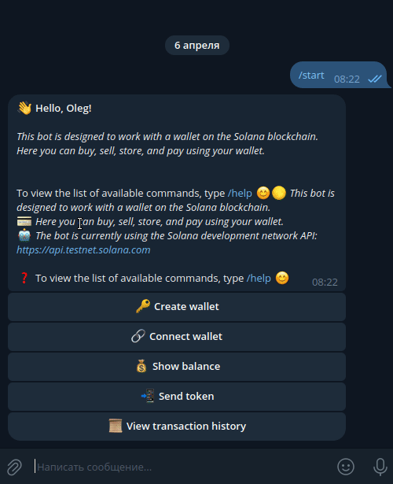
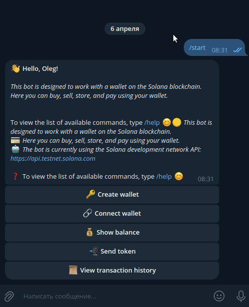

# Solana Wallet Telegram Bot

Telegram wallet for the Solana network

### Demo version

#### Test node - https://api.testnet.solana.com:
- SolanaWallet
- t.me/solana_wallet_crypto_bot
- @solana_wallet_crypto_bot

## Installation

```bash
# clone the repository
git clone https://github.com/Shrekulka/solana-webwallet.git
# go to the project folder
cd solana-webwallet/
# install and activate the virtual environment
python3.12 -m venv env
source env/bin/activate
# insatll requirements
pip install -r requirements.txt
```

## Before run

Before running the bot, you need to create a `.env` settings file.

In this file you need to specify your token to access the Telegram API, the database engine and etc.

- Create a bot using BotFather in Telegram and receive a token.
- Make sure your bot has the update mode enabled via polling.

Example `.env`:
```bash
# Settings for the token and list of administrators for the bot.
# BOT_TOKEN - token for accessing the Telegram API.
BOT_TOKEN=5424991242:AAGwomxQz1p46bRi_2m3V7kvJlt5RjK9yr0
# ADMIN_IDS - list of bot administrator IDs, separated by comma.
ADMIN_IDS=[173901673,124543434,143343455]

# Settings for connecting to the database.
# DB_NAME - database name
DB_NAME=my_database
# DB_HOST - database host
DB_HOST=localhost
# DB_USER - database user
DB_USER=dbUser
# DB_PASSWORD - password
DB_PASSWORD=dbPassword
# DB_ENGINE - engine
DB_ENGINE=sqlite
# DB_ENGINE=postgresql
```

If `postgresql` is selected as the database, then you can run it in Docker.

### Running a container in docker `postgresql`

```bash
# go to the compose folder:
cd solana-webwallet/compose/
# up postgresql container:
docker-compose -f docker-compose.yml up -d
# down postgresql container:
docker-compose -f docker-compose.yml down -v
```

### Running a bot

```bash
# go to the project folder
cd solana-webwallet/
# if not activated yet, then activate the virtual environment
source env/bin/activate
# running a bot
python bot.py
```

## After run, the bot will be available on Telegram

### Creating a wallet



### Connecting an existing wallet


### Sending tokens to another address



### Show information about recent transactions


```bash
📁 solana_wallet/                                  # Директория проекта, основной файл бота.
│
├── .env                                          # Файл с конфигурацией и секретами.
│
├── .env.example                                  # Пример файла .env для других разработчиков.
│
├── bot.py                                        # Основной файл проекта, точка входа.
│
├── requirements.txt                              # Файл с зависимостями проекта.
│
├── logger_config.py                              # Конфигурация логгера.
│
├── README.md                                     # Файл с описанием проекта.
│
├── *.db                                          # Файл базы данных SQLite, используемый в проекте.
│
├── 📁 config_data/                               # Пакет с конфигурационными данными.
│   ├── __init__.py                               # Файл, обозначающий, что директория является пакетом Python.
│   └── config.py                                 # Модуль с конфигурационными данными.
│
├── 📁 database/                                  # Пакет для работы с базой данных.
│   ├── __init__.py                               # Файл-инициализатор пакета.
│   └── database.py                               # Модуль с шаблоном базы данных.
│
├── 📁 external_services/                         # Пакет, содержащий модули для взаимодействия с внешними сервисами и API.
│    ├── 📁 solana/                               # Подпакет, связанный с интеграцией с Solana.
│    │    ├── __init__.py                         # Файл-инициализатор подпакета.
│    │    └── solana.py                           # Модуль с функциями для работы с кошельками Solana и выполнения транзакций.
│    └── __init__.py                              # Файл-инициализатор пакета external_services.
│
├── 📁 filters/                                   # Пакет с кастомными фильтрами.
│   ├── __init__.py                               # Файл, обозначающий, что директория является пакетом Python.
│   └── is_admin.py                               # Модуль с функцией-фильтром для проверки администратора.
│
├── 📁 handlers/                                  # Пакет с обработчиками апдейтов.
│   ├── __init__.py                               # Файл, обозначающий, что директория является пакетом Python.
│   ├── admin_handlers.py                         # Модуль с хэндлерами для администраторов.
│   ├── user_handlers.py                          # Модуль с хэндлерами для пользователей с особым статусом.
│   └── other_handlers.py                         # Модуль с хэндлерами для обычных пользователей.
│
├── 📁 keyboards/                                 # Пакет с модулями для работы с клавиатурами.
│   ├── __init__.py                               # Файл, обозначающий, что директория является пакетом Python.
│   └──  keyboards.py                             # Модуль с функциями для клавиатур.
│
├── 📁 lexicon/                                   # Пакет для хранения текстов ответов бота.
│   ├── __init__.py                               # Файл, обозначающий, что директория является пакетом Python.
│   └── lexicon_en.py                             # Модуль с текстами на английском.
│
├── 📁 models/                                    # Пакет с модулями для работы с базой данных.
│   ├── __init__.py                               # Файл, обозначающий, что директория является пакетом Python.
│   └── models.py                                 # Cодержит определения моделей данных, используемых в приложении для
│                                                 # взаимодействия с базой данных через SQLAlchemy ORM.
├── 📁 states/                                    # Пакет с классами состояний пользователей.
│   ├── __init__.py                               # Файл, обозначающий, что директория является пакетом Python.
│   └── states.py                                 # Модуль с классами состояний.
│
└── 📁 utils/                                     # Пакет с вспомогательными модулями.
    ├── __init__.py                               # Файл, обозначающий, что директория является пакетом Python.
    └── utils.py                                  # Модуль с вспомогательными утилитами.
```
