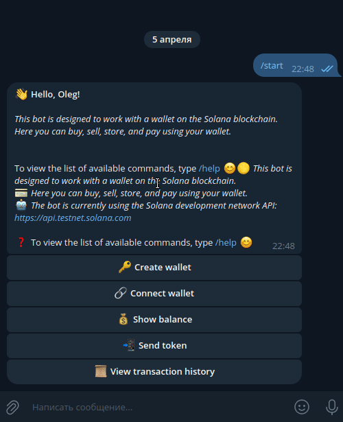
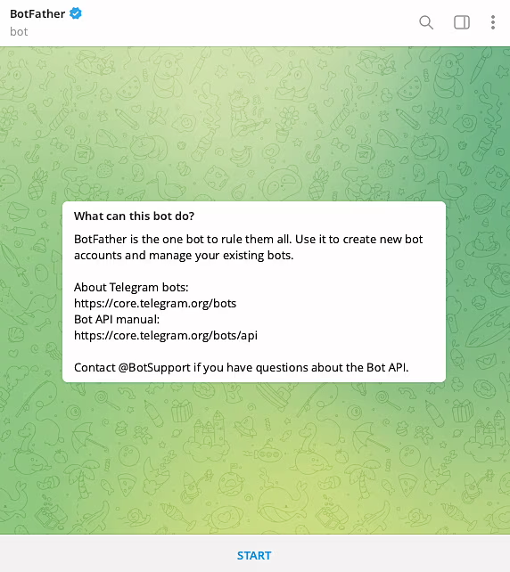
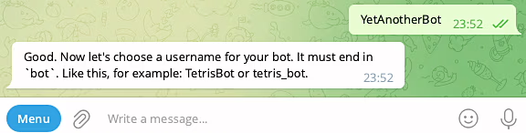
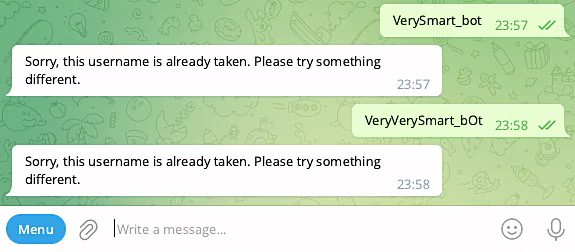
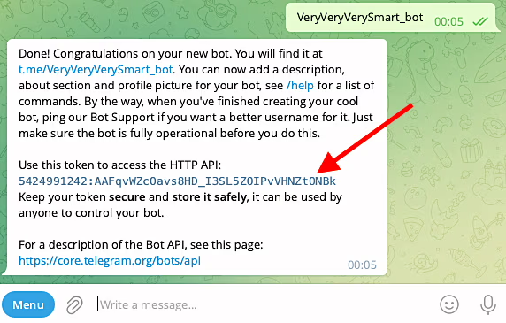

# Solana Wallet Telegram Bot

## Russian

Телеграм кошелёк для сети Solana

Работоспособность проверялась с `Python 3.11`

## Установка

```bash
# клонируем репозиторий
git clone https://github.com/Shrekulka/solana-webwallet.git
# переходим в папку проекта
cd solana-webwallet/
# устанавливаем и активируем виртуальное окружение
python3.12 -m venv env
source env/bin/activate
# устанавливаем зависимости
pip install -r requirements.txt
```

## Подготовка перед использованием

Перед запуском нужно создать и заполнить файл `.env` настроек.

В нём нужно указать свой токен для доступа к API Telegram, движок бд.

- Создайте бота через BotFather в Telegram и получите токен вашего бота.
- Убедитесь, что у вашего бота включен режим обновлений через polling (опрос).

Пример `.env`:
```bash
# solana_wallet_telegram_bot/.env

# Настройки токена и списка администраторов для бота.
# BOT_TOKEN - токен для доступа к API Telegram.
BOT_TOKEN=5424991242:AAGwomxQz1p46bRi_2m3V7kvJlt5RjK9xr0
# ADMIN_IDS - список идентификаторов администраторов бота, разделенных запятой.
ADMIN_IDS=[173901673,124543434,143343455]

# Настройки для подключения к базе данных.
# DB_NAME - название базы данных.
DB_NAME=my_database
# DB_HOST - адрес хоста базы данных.
DB_HOST=localhost
# DB_USER - имя пользователя базы данных.
DB_USER=dbUser
# DB_PASSWORD - пароль для доступа к базе данных.
DB_PASSWORD=dbPassword
# движок бд
DB_ENGINE=sqlite
# DB_ENGINE=postgresql
```

Если в качестве базы данных выбрана `postgresql` то запустить её можно в докере.

### Запуск в докере контейнера `postgresql`

```bash
# переходим в папку compose:
cd solana-webwallet/compose/
# запуск контейнера postgresql:
docker-compose -f docker-compose.yml up -d
# для остановки:
docker-compose -f docker-compose.yml down -v
```

### Запуск бота

```bash
# переходим в папку проекта
cd solana-webwallet/
# если ещё не активировали, то активируем виртуальное окружение
source env/bin/activate
# запуск бота
python bot.py
```

## Чтобы запустить данный код через IDE

### Через IDE:

1. Установка зависимостей:
Убедитесь, что у вас установлены все зависимости, указанные в файле 'requirements.txt'. Если нет, установите их,
выполнив следующую команду:

```bash
pip install -r requirements.txt
```

2. Запуск кода:
Откройте файл 'bot.py' в вашей IDE (например, PyCharm, VSCode, etc.). Запустите код, нажав на кнопку запуска или
используя соответствующую комбинацию клавиш. В случае PyCharm, вы можете просто нажать кнопку "Run" рядом с определением
функции main.

## После запуска бот будет доступен в Telegram

### Создание кошелька


### Подключение существующего кошелька



### Перевод токенов на другой адрес


### Показать информацию о последних транзакциях


### Структура проекта:
```bash
📁 solana_wallet_telegram_bot/                   # Директория проекта, основной файл бота.
│
├── .env                                          # Файл с конфигурацией и секретами.
│
├── .env.example                                  # Пример файла .env для других разработчиков.
│
├── .gitignore                                    # Файл для игнорирования файлов системой контроля версий.
│
├── bot.py                                        # Основной файл проекта, точка входа.
│
├── requirements.txt                              # Файл с зависимостями проекта.
│
├── logger_config.py                              # Конфигурация логгера.
│
├── README.md                                     # Файл с описанием проекта.
│
├── my_fast_blog_database.db                      # Файл базы данных SQLite, используемый в проекте.
│
├── 📁 config_data/                               # Пакет с конфигурационными данными.
│   ├── __init__.py                               # Файл, обозначающий, что директория является пакетом Python.
│   └── config.py                                 # Модуль с конфигурационными данными.
│
├── 📁 database/                                  # Пакет для работы с базой данных.
│   ├── __init__.py                               # Файл-инициализатор пакета.
│   └── database.py                               # Модуль с шаблоном базы данных.
│
├── 📁 external_services/                         # Пакет, содержащий модули для взаимодействия с внешними сервисами и API.
│    ├── 📁 solana/                               # Подпакет, связанный с интеграцией с Solana.
│    │    ├── __init__.py                         # Файл-инициализатор подпакета.
│    │    └── solana.py                           # Модуль с функциями для работы с кошельками Solana и выполнения транзакций.
│    └── __init__.py                              # Файл-инициализатор пакета external_services.
│
├── 📁 filters/                                   # Пакет с кастомными фильтрами.
│   ├── __init__.py                               # Файл, обозначающий, что директория является пакетом Python.
│   └── is_admin.py                               # Модуль с функцией-фильтром для проверки администратора.
│
├── 📁 handlers/                                  # Пакет с обработчиками апдейтов.
│   ├── __init__.py                               # Файл, обозначающий, что директория является пакетом Python.
│   ├── admin_handlers.py                         # Модуль с хэндлерами для администраторов.
│   ├── user_handlers.py                          # Модуль с хэндлерами для пользователей с особым статусом.
│   └── other_handlers.py                         # Модуль с хэндлерами для обычных пользователей.
│
├── 📁 keyboards/                                 # Пакет с модулями для работы с клавиатурами.
│   ├── __init__.py                               # Файл, обозначающий, что директория является пакетом Python.
│   └──  keyboards.py                             # Модуль с функциями для клавиатур.
│
├── 📁 lexicon/                                   # Пакет для хранения текстов ответов бота.
│   ├── __init__.py                               # Файл, обозначающий, что директория является пакетом Python.
│   └── lexicon_en.py                             # Модуль с текстами на английском.
│
├── 📁 models/                                    # Пакет с модулями для работы с базой данных.
│   ├── __init__.py                               # Файл, обозначающий, что директория является пакетом Python.
│   └── models.py                                 # Cодержит определения моделей данных, используемых в приложении для
│                                                 # взаимодействия с базой данных через SQLAlchemy ORM.
├── 📁 states/                                    # Пакет с классами состояний пользователей.
│   ├── __init__.py                               # Файл, обозначающий, что директория является пакетом Python.
│   └── states.py                                 # Модуль с классами состояний.
│
└── 📁 utils/                                     # Пакет с вспомогательными модулями.
    ├── __init__.py                               # Файл, обозначающий, что директория является пакетом Python.
    └── utils.py                                  # Модуль с вспомогательными утилитами.
```

## Как создать телеграм-бота
Итак, у вас установлен Telegram и есть аккаунт. Отлично! Заходим в поиск и набираем "BotFather". Найдется несколько
похожих, но нам нужен официальный - с синей галочкой. Ну, или, вот, вам ссылка - @BotFather.

Выбираем правильного "Отца ботов" и нажимаем в открывшемся чате "START"

Появится сообщение со списком команд, которые можно отправить отцу ботов. Там много всего интересного. Сейчас же нас
интересует команда "/newbot". Либо кликаем прямо по ней, либо еще в левом нижнем углу можно нажать на кнопку "Menu" и
там тоже откроется возможность выбрать нужную команду. Смело нажимаем!


BotFather предложит выбрать имя нашему новому боту.

Пишем любое имя. Его, в дальнейшем, можно будет изменить при желании.

Далее нужно задать username нашему боту - уникальное имя, которое нельзя будет менять, и которое обязательно должно
оканчиваться на "bot". Причем регистр букв не имеет значения. Может быть и "BOT", и "bot", и "Bot" и даже "boT". Длина
юзернейма должна быть от 5 до 32 символов. Можно использовать латинские буквы, цифры и подчеркивания. Так написано в
официальной документации Телеграм.
И хотя, из этого описания можно подумать, что username бота может начинаться с цифры или подчеркивания, на самом деле
Телеграм не дает этого сделать.


То есть, получается, что username должен быть длиной от 5 до 32 символов, среди которых могут быть буквы, цифры и
подчеркивания, но начинаться должен обязательно с буквы, а заканчиваться обязательно словом "bot", причем, регистр
значения не имеет.

Из-за того, что юзернейм должен быть уникальным, подобрать его может быть не очень просто - многие уже заняты.
Пользователи создавали ботов, игрались, а потом забрасывали их. Наверное, где-то в недрах серверов Telegram существует
кладбище мертворожденных ботов.

Наконец, после очередной попытки, все же удается придумать незанятый username для бота. С чем нас и поздравит Ботопапа.

Для дальнейшей работы нам понадобится токен. Его лучше никому не показывать, чтобы никто не смог от имени вашего бота
творить всякое. При необходимости токен боту можно поменять. Также через @BotFather.

И имейте в виду, что в рамках одного телеграм-аккаунта допускается управлять максимум 20 ботами. Об этом не сказано в
официальной документации Telegram (ну, или я не нашел), но выяснено многими пользователями опытным путем.

Примечание. Чтобы на любом этапе взаимодействия с @BotFather получить от него список доступных команд - просто отправьте
в чат с ним команды /start или /help.
